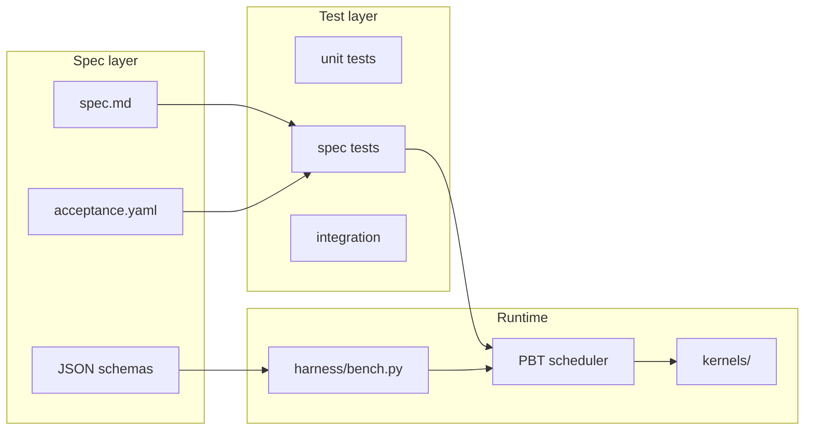

# Architecture overview

## Components

## Data flow (one PBT generation)

1. **Population** holds N kernel candidates (source + metadata).
2. **Harness** compiles, runs correctness stages, benchmarks vs baseline.
3. **Fitness** derived from `HarnessResult` (correctness gate + speedup).
4. **PBT step** copies weights/config from top performers, mutates explorers.
5. **Ledger** appends validated JSON lines to `.runs/<run_id>/results.jsonl`.

## Contracts

See [`contracts/`](../contracts/) for typed boundaries between modules.

## Non-goals (v0.1 skeleton)

- Full KernelBench integration (stub hooks only)
- Multi-GPU distributed PBT
- LLM agent orchestration (interface reserved in specs)
