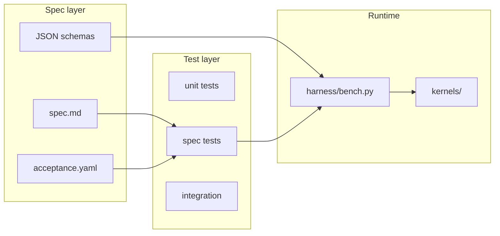

# Architecture overview

## Components

## Data flow (one evaluation)

1. **Harness** compiles a candidate kernel, runs correctness stages, benchmarks vs baseline.
2. **Correctness** must pass before any speedup is recorded.
3. **Ledger** appends validated JSON lines to `.runs/<run_id>/results.jsonl`.

## Contracts

See [`contracts/`](../contracts/) for typed boundaries between modules.

## Non-goals (v0.1 skeleton)

- Full KernelBench integration (stub hooks only)
- Distributed multi-device evaluation
- LLM agent orchestration (interface reserved in specs)
