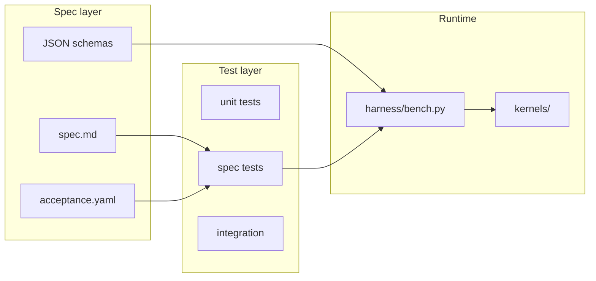

# Architecture overview

## Components

```mermaid
flowchart LR
  subgraph spec["Spec layer"]
    SPEC[spec.md]
    ACC[acceptance.yaml]
    SCH[JSON schemas]
  end

  subgraph test["Test layer"]
    UT[unit tests]
    ST[spec tests]
    IT[integration]
  end

  subgraph runtime["Runtime"]
    HAR[harness/bench.py]
    KRN[kernels/]
  end

  SPEC --> ST
  ACC --> ST
  SCH --> HAR
  ST --> HAR
  HAR --> KRN
```

## Data flow (one evaluation)

1. **Driver** (`props/driver.run_task`) generates case groups from a seed, runs the kernel on a
   backend, and records every execution to `<run_dir>/rows.parquet` + `tensors/*.safetensors`.
2. **Arms** score the recorded rows offline, in randomized order, into `<run_dir>/scores.parquet`;
   `driver.read_run` returns the pair only if their corpus fingerprints match.
3. **Metrics** (`metrics.rates`, `metrics.report`) compute per-arm detection rates per case group.

`harness/bench.py` is the feature 0001/0002 skeleton: its stages always pass and its benchmark
numbers are placeholders.

## Contracts

See [`contracts/`](../../contracts/) for typed boundaries between modules.

## Non-goals (v0.1 skeleton)

- Full KernelBench integration (stub hooks only)
- Distributed multi-device evaluation
- LLM agent orchestration (interface reserved in specs)
